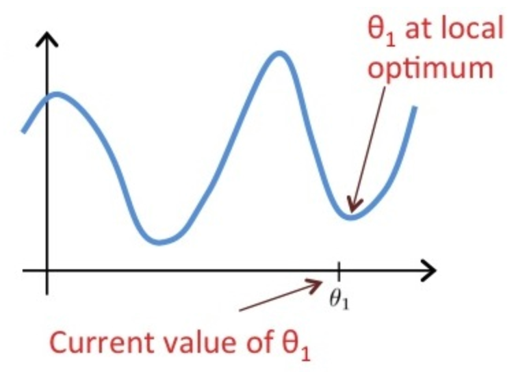

# [目录](../README.md)

# Linear Regression

## Definition
对于回归问题, 假设有一堆训练集, 记:
*  - 训练集的样本数量
*  - 输入变量/特征
*  - 输出变量/目标变量
*  - 一个样本对
*  - 第个样本对

## Model Representation
学习算法通过对训练数据的学习来获取模型, 也称作hypothesis.
在预测阶段, 将输入模型得到预测的.

## Cost Function
我们可以采用代价函数来评估模型的准确性.

假设模型为:

其中, 和是待定参数, 不同的参数得到的模型也不同.

目标是选取最好的和, 使得模型对训练集的拟合程度较好,
即尽可能与接近, 那么可以将代价函数写成:

因此, 目标就转化为最小化代价函数:

可以将代价函数对和求偏导并等于0, 从而得到最优的参数.

## Gradient Descent
给定不同的参数和, 得到的代价函数值也不一样,
可以将代价函数随着参数变化的曲面绘制出来. 代价函数最小的点, 也就是曲线上最低的点,
此时的参数就是最优模型. 给定初始的参数和,
采用梯度下降算法对参数不断更新, 在曲面上不断"下山", 直到最低点得到最优的参数.

梯度下降算法:

上式中, 称作学习率. 如果学习率较大, 梯度下降就会采用较大的步长下降;
如果学习率较小, 梯度下降就会采用较小的步长下降.

## Learning Rate
学习率太小, 梯度下降速度可能会很慢.

学习率太大, 梯度下降可能错误局部最优点, 可能不会收敛, 甚至发散.

如果达到最优点, 此时梯度下降算法再更新, 参数就不会再发生变化.

由于梯度下降过程中, 梯度项会不断减小, 因此, 即时学习率固定, 也可以收敛到局部最优.

## Gradient Descent For Linear Regression
将线性回归的模型代入梯度下降的公式, 偏导项变为:

可以求出和时的偏导项为:

## Quiz
