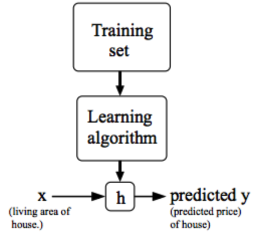

# [目录](../README.md)

# Linear Regression

## Definition
对于回归问题, 假设有一堆训练集, 记:
*  - 训练集的样本数量.
*  - 输入变量/特征.
*  - 输出变量/目标变量.
*  - 一个样本对.
*  - 第个样本对.

## Model Representation
学习算法通过对训练数据的学习来获取模型, 也称作hypothesis.
在预测阶段, 将输入模型得到预测的.

## Cost Function
我们可以采用代价函数来评估模型的准确性.

假设模型为:

其中, 和是待定参数, 不同的参数得到的模型也不同.

目标是选取最好的和, 使得模型对训练集的拟合程度较好,
即尽可能与接近, 那么可以将代价函数写成:

因此, 目标就转化为最小化代价函数:

可以将代价函数对和求偏导并等于0, 从而得到最优的参数.

## Gradient Descent
给定不同的参数和, 得到的代价函数值也不一样,
可以将代价函数随着参数变化的曲面绘制出来. 代价函数最小的点, 也就是曲线上最低的点,
此时的参数就是最优模型. 给定初始的参数和,
采用梯度下降算法对参数不断更新, 在曲面上不断"下山", 直到最低点得到最优的参数.

梯度下降算法:

上式中, 称作学习率. 如果学习率较大, 梯度下降就会采用较大的步长下降;
如果学习率较小, 梯度下降就会采用较小的步长下降.

梯度下降算法根据每次更新使用的数据量, 分为:
* Batch Gradient Descent: 每次使用所有训练数据.
* Mini-Batch Gradient Descent: 每次使用训练数据的一个子集.

## Learning Rate
学习率太小, 梯度下降速度可能会很慢.

学习率太大, 梯度下降可能错过局部最优点, 可能不会收敛, 甚至发散.

如果达到最优点, 此时梯度下降算法再更新, 参数就不会再发生变化.

由于梯度下降过程中, 梯度项会不断减小, 因此, 即时学习率固定, 也可以收敛到局部最优.

## Gradient Descent For Linear Regression
将线性回归的模型代入梯度下降的公式, 偏导项变为:

可以求出和时的偏导项为:

那么梯度下降算法变为:

注意: 线性回归的搜索空间为凸函数, 因此仅存在全局最优解.

## Multivariate Linear Regression
拓展到更一般的形式, 记:
*  - 特征的维度.
*  - 第个样本.
*  - 第个样本的第个特征.

将模型写成:

将上式向量化, 记:

, 

将样就可以将模型写成:

代价函数为:

梯度下降为:

将线性回归模型代入代价函数可以推导出梯度下降为:

## Quiz
1. Consider the problem of predicting how well a student does in her
second year of college/university, given how well she did in her first
year.  
Specifically, let  be equal to the number of "A" grades (including
A-. A and A+ grades) that a student receives in their first year of
college (freshmen year). We would like to predict the value of ,
which we define as the number of "A" grades they get in their second
year (sophomore year).  
Refer to the following training set of a small sample of different
students' performances (note that this training set may also be
referenced in other questions in this quiz). Here each row is one
training example. Recall that in linear regression, our hypothesis is
, and we use  to denote the
number of training examples.  
For the training set given above, what is the value of ?  
(4)

2. Many substances that can burn (such as gasoline and alcohol) have a
chemical structure based on carbon atoms; for this reason they are
called hydrocarbons. A chemist wants to understand how the number of
carbon atoms in a molecule affects how much energy is released when that
molecule combusts (meaning that it is burned). The chemist obtains the
dataset below. In the column on the right, "kJ/mol" is the unit
measuring the amount of energy released.  
You would like to use linear regression () to estimate the amount of energy released () as a
function of the number of carbon atoms (). Which of the following
do you think will be the values you obtain for  and
?  
You should be able to select the right answer without actually
implementing linear regression.  
(D)  
A.   
B.   
C.   
D. 

3. Suppose we set  in the linear
regression hypothesis from Q1. What is ?  
(11)

4. Let  be some function so that  outputs
a number. For this problem,  is some arbitrary/unknown smooth
function (not necessarily the cost function of linear regression, so
 may have local optima).  
Suppose we use gradient descent to try to minimize
 as a function of  and .
Which of the following statements are true? (Check all that apply.)  
(AD)  
A. If the learning rate is too small, then gradient descent may take a
very long time to converge.  
B. If  and  are initialized so that
, then by symmetry (because we do simultaneous
updates to the two parameters), after one iteration of gradient descent,
we will still have .  
C. Even if the learning rate  is very large, every iteration of
gradient descent will decrease the value of .  
D. If  and  are initialized at a local minimum,
then one iteration will not change their values.

5. Suppose that for some linear regression problem (say, predicting
housing prices as in the lecture), we have some training set, and for
our training set we managed to find some ,  such
that .  
Which of the statements below must then be true? (Check all that apply.)  
(D)  
A. For this to be true, we must have  and
, so that .  
B. Gradient descent is likely to get stuck at a local minimum and fail
to find the global minimum.  
C. For this to be true, we must have  for every value of
.  
D. Our training set can be fit perfectly by a straight line, i.e., all
of our training examples lie perfectly on some straight line.
