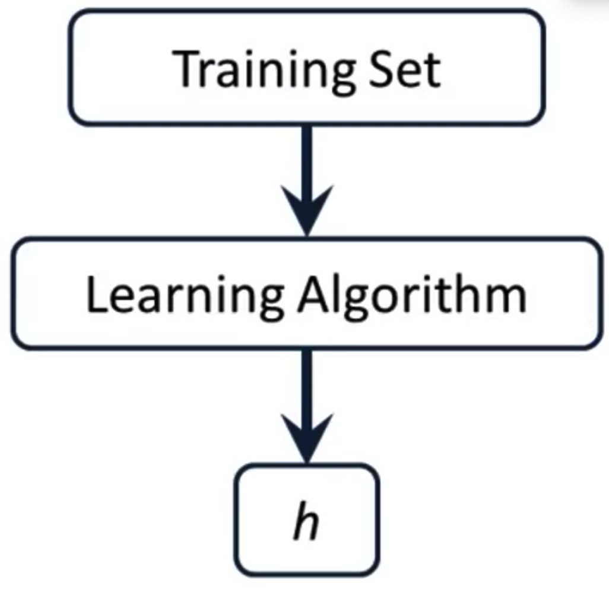

# [目录](../README.md)

# Model and Cost Function

## 符号定义
对于回归问题, 假设有一堆训练集, 记:  
$m$ - 训练集的样本数量  
$x_s$ - 输入变量/特征  
$y_s$ - 输出变量/目标变量  
$(x, y)$ - 一个样本对  
$(x^{(i)}, y^{(i)})$ - 第i个样本对  

## Model Representation
学习算法通过对训练数据的学习来获取模型$h: X \rightarrow Y$, 也称作hypothesis.
在预测阶段, 将$x$输入模型$h$得到预测的$y$.

## Quiz
