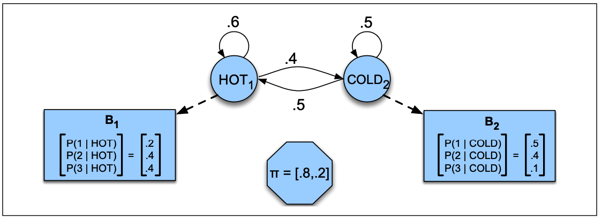
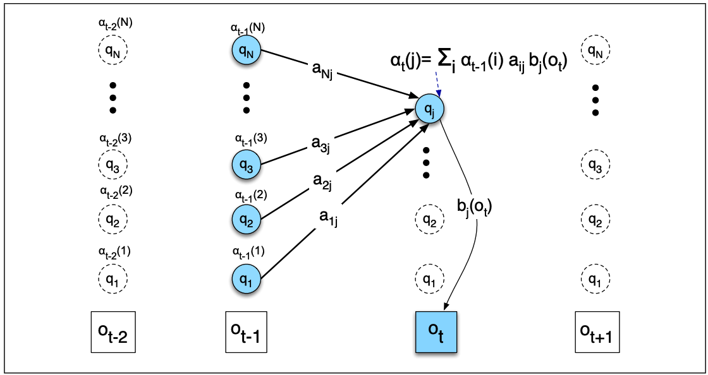
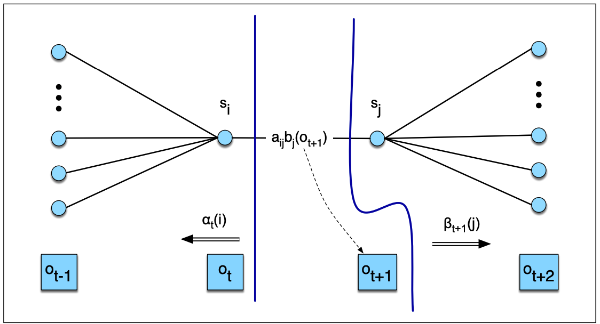

# [目录](../README.md)

# Hidden Markov Models

## Markov Chains

马尔科夫链, 是状态空间中从一个状态到另一个状态转换的随机过程.
对于马尔科夫链, 如果要从一个序列进行预测, 当前状态起到决定的作用,
历史状态对于预测没有影响.

假设一个序列内的状态变量为. 可以将马尔可夫假设表示为:

下图a给出了天气变化的马尔科夫链, 可能的天气为HOT, COLD和WARM.
图中, 状态以节点表示, 每条边上标明转移概率, 每个节点所有边的转移概率之和为1.
图b给出了一个二元语言模型的马尔科夫链.

综上, 马尔科夫链主要由三个部分组成:

* 为个节点的集合.
* 为转移概率矩阵, 表示节点到节点的转移概率,
且满足.
* 为节点的初始概率分布, 满足,
表示不可能为初始状态节点.

例如上图a中, 假设初始概率分布为,
那么:

## Hidden Markov Models

很多情况下, 我们关心的状态是隐藏起来的.
例如, 我们通过文本无法直接观测到词性标注(POS), 我们只可以观测到词.
POS只能通过词序列来推测, 因此是被隐藏起来的.

HMM是一个同时包含了观测状态和隐藏状态的概率模型, 由五个部分组成:

* 为个节点的集合.
* 为转移概率矩阵, 表示节点到节点的转移概率,
且满足.
* 为观测序列, 每个观测值来源于词典.
* 为发射概率, 表示节点产生观测的概率.
* 为节点的初始概率分布, 满足,
表示不可能为初始状态节点.

一阶马尔可夫模型遵循两个假设:

1. 某个状态节点的概率仅与前一个状态节点有关:

2. 观测值仅与产生该观测值的节点有关, 与其他状态节点或者观测值无关,
即输出独立性:

下面用一个例子简述HMM模型. 假设有两种天气COLD(C)和HOT(H), 但是没有天气的信息,
只有每天吃掉的冰淇淋数量. 那么问题变成: 已知观测序列(每天吃掉的冰淇淋数量),
寻找天气(C或者H)对应的隐序列, 如下图.
观测序列对应每天吃掉的冰淇淋数量.

HMM的三个问题:

1. Likelihood: 已知HMM模型 , 给定观测序列,
计算似然.
2. Decoding: 已知HMM模型 , 给定观测序列,
获取最可能的隐状态序列.
3. Learning: 给定观测序列和一系列状态, 学习HMM的参数和.

下面以冰淇淋-天气案例, 分别对这三个问题进行分析和求解, 代码见[exercise.py](exercise.py).

## Likelihood - The Forward Algorithm

假设HMM已知, 计算观测序列(冰淇淋数量)为3 1 3的概率.

由于每个隐状态仅仅产生一个观测值, 隐状态序列长度与观测值序列长度相等.
那么, 给定隐状态序列和观测序列
, 观测序列的似然可以表示为:

那么一条可能的隐状态hot hot cold对应的似然为:

每一条隐状态序列的产生都拥有一定的概率, 容易求出其概率, 得到加权后观测序列的似然为:

即:

最后, 将所有可能的隐状态序列对应的似然进行加权求和:

即:

### The Forward Algorithm

对于拥有个隐状态的HMM, 如果观测序列长度为, 那么总共可能有
个隐序列. 对于一般的任务, 和可能很大, 导致计算代价太大.

因此采用动态规划的前向算法, 对每一条可能的路径进行概率求和, 复杂度为.

如上图, 网格的节点表示经历过前个观测后状态的总概率:

可以得到的递归表达:

这样可以将前向算法写作:

1. 初始化:

2. 递归:

3. 终止:

## Decoding - The Viterbi Algorithm

解码, 就是给定观测序列, 获取概率最大的隐序列.

例如, 对于例子中的HMM, 给定观测序列(冰淇淋数量){3, 1, 3},
解码的目标是获取最可能的天气序列.

对于每一条隐序列, 我们可以通过前向算法计算其似然, 然后找到似然最大的隐序列,
但是这种算法复杂度太高. 因此采用动态规划的Viterbi算法来计算, 如下图.

Viterbi算法的思想是, 针对观测序列从左到右计算网格值,
代表了状态对于前个观测值最可能的隐状态序列
的概率:

容易得到的递归表达:

为了获取最大似然的隐状态序列, 在动态计算概率的过程中,
还需要一个状态量来保存每次取max的路径.

这样可以将Viterbi算法写作:

1. 初始化:

2. 递归:

3. 终止:

## HMM Training - The Forward-Backward Algorithm

HMM训练采用前向-后向算法, 或者Baum-Wehch算法, 一种EM算法来训练.
给定观测序列和可能的隐状态集合, 通过训练来学习HMM的转移概率和发射概率.
对于每一次迭代, 通过一个状态量来评估模型的优劣, 并不断朝着优化状态量的方向更新.

对于一个简单的例子, 假设存在三组观测序列和隐序列的对应关系:
hot hot cold -> 3 3 2; cold cold cold -> 1 1 2; cold hot hot -> 1 2 3.

那么很容易通过最大似然估计得到HMM的参数:

然而, 实际情况下, 我们无法知道一个观测序列对应的隐状态序列, 我们仅仅能获取其概率.

在前向算法中定义了前向概率, 还需要定义后向概率, 表示从
个观测值到最后的概率:

后向概率的计算与前向概率相似:

1. 初始化:

2. 递归:

3. 终止:

通过前向概率和后向概率就可以估计转移概率和发射概率. 转移概率的最大似然估计为:

对于上式的分母, 如果对于观测序列上时刻的某个观测值,
能够估计出的转移概率,
那么可以通过对所有时刻的求和得到的转移概率.

定义时刻状态为, 时刻状态为的概率为:

为了计算上式, 先计算包含观测序列概率的:

从上图可以看出的计算为:

根据贝叶斯定理:

可得:

那么将上式对所有求和就可以得到从状态到状态的所有转移数量.
还需要计算状态的所有转移数量, 可以对所有以状态为起始的转移进行求和得到.
这样, 就得到了转移概率的计算公式:

同样, 还需要计算发射概率:

为了计算上式, 需要知道时刻在状态的概率:

根据贝叶斯定理, 可以将上式写作:

通过上图可以看出, 分子项就是前向概率和后向概率的乘积, 那么可得:

那么就得到了发射概率的计算如下:

这样, 就可以通过E-M算法不断迭代估计HMM的参数, 直到收敛. 前向后向算法如下:

1. 初始化转移概率矩阵和发射概率矩阵.

2. E-step:

3. M-step

4. 重复2和3直到收敛, 返回和.
