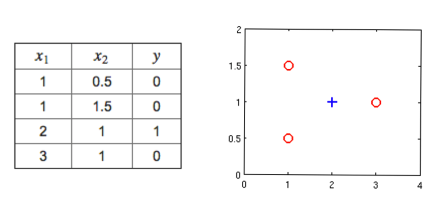
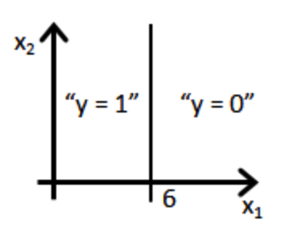
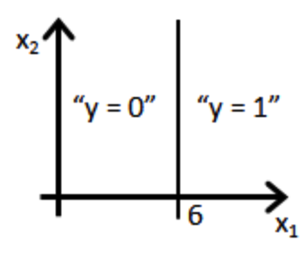
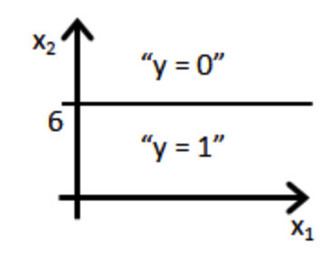
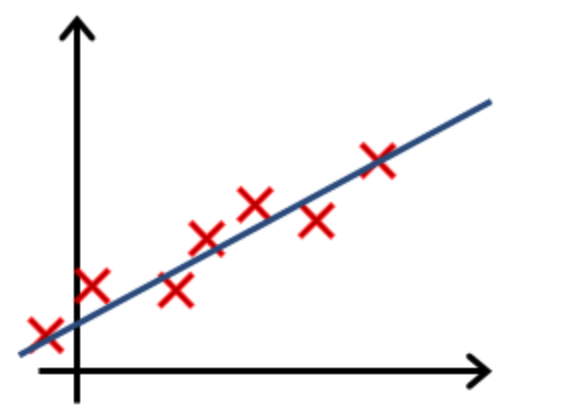
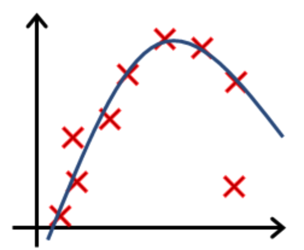
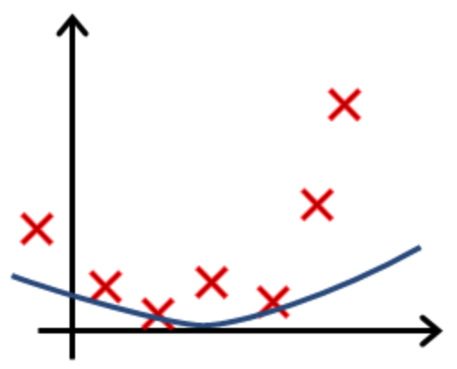

# [目录](../README.md)

# Logistic Regression

## Hypothesis Representation
对于二分类问题, 可以采用逻辑回归模型. 逻辑回归模型的输出满足:

$$ 0 \leq h_\theta(x) \leq 1 $$

这样, 可以设定一个阈值来进行二分类.

逻辑回归模型为:

$$ h_\theta(x) = g(\theta^T x) $$

$$ g(z) = \frac {1} {1 + e^{-z}} $$

式中, $ g(z) $也称作sigmoid函数, 如下图.

可以看出, sigmoid函数使得输出范围在[0, 1]之间.

逻辑回归模型也看作对于输入$ x $, 预测得到输入为$ y $的概率, 即:

$$ h_\theta(x) = P(y = 1 | x; \theta) $$

由于二分类问题的输出只是为0和1, 因此满足:

$$ P(y = 0 | x; \theta) + P(y = 1 | x; \theta) = 1 $$

## Cost Function
假如采用类似线性回归的均方误差代价函数, 那么逻辑回归的代价函数是非凸函数,
可能拥有很多局部最优. 因此, 根据逻辑回归的定义, 可以采用如下的代价函数:

$$
J(h_\theta(x), y) =
\left\{
\begin{aligned}
\ \ \ -log(h_\theta(x)) \ if \ y = 1 \\
-log(1 - h_\theta(x)) \ if \ y = 0 \\
\end{aligned}
\right.
$$

可以看出:
* 当$ h_\theta(x) = y $时, 代价函数为0.
* 当$ y = 0, h_\theta(x) \rightarrow 1 $时, 代价函数趋向于无穷大.
* 当$ y = 1, h_\theta(x) \rightarrow 0 $时, 代价函数趋向于无穷大.

为了便于推导梯度下降, 可以将代价函数写成更简单的形式:

$$ J(h_\theta(x), y) = - y log(h_\theta(x))
                       - (1 - y) log(1 - h_\theta(x)) $$

上式为仅针对一个样本的代价函数, 对于一个数据集, 代价函数写成:

$$ J(\theta) = - \frac {1} {m} \sum_{i = 1}^m
[ - y^{(i)} log(h_\theta(x^{(i)}))
  - (1 - y^{(i)}) log(1 - h_\theta(x^{(i)}))] $$

这个代价函数的优点在于它是凸函数, 也可以用最大似然法求解得到.

## Gradient Descent
梯度下降算法为:

$$ \theta_j := \theta_j - \alpha \frac {\partial} {\partial \theta_j}
J(\theta) $$

由于:

$$ h_\theta(x) = \frac {1} {1 + e^{- \theta^T x}} $$

可得:

$$
\begin{aligned}
\frac {\partial} {\partial \theta_j} h_\theta(x)
& = \frac {\partial} {\partial \theta_j}
    \frac {1} {1 + e^{- \theta^T x}} \\
& = - \frac {1} {(1 + e^{- \theta^T x) ^ 2}}
      \frac {\partial} {\partial \theta_j} e^{- \theta^T x} \\
& = - (h_\theta(x))^2 e^{- \theta^T x}
      \frac {\partial} {\partial \theta_j} (-\theta^T x) \\
& = (h_\theta(x))^2 e^{- \theta^T x} \cdot x_j \\
\end{aligned}
$$

可得:

$$
\begin{aligned}
& \ \ \ \ \frac {\partial} {\partial \theta_j}
  [- y log(h_\theta(x)) - (1 - y) log(1 - h_\theta(x))] \\
& = - \frac {y} {h_\theta(x)} \frac {\partial} {\partial \theta_j}
    h_\theta(x) + \frac {1 - y} {1 - h_\theta(x)}
    \frac {\partial} {\partial \theta_j} h_\theta(x) \\
& = \frac {h_\theta(x) - y} {h_\theta(x) (1 - h_\theta(x))}
    \frac {\partial} {\partial \theta_j} h_\theta(x) \\
& = \frac {h_\theta(x) (h_\theta(x) - y)} {1 - h_\theta(x)}
    e^{- \theta^T x} \cdot x_j \\
& = \frac {\frac {1} {1 + e^{- \theta^T x}}}
    {1 - \frac {1} {1 + e^{- \theta^T x}}} e^{- \theta^T x}
    (h_\theta(x) - y) x_j \\
& = (h_\theta(x) - y) x_j
\end{aligned}
$$

通过上式可以得到梯度下降为:

$$ \theta_j := \theta_j - \alpha \frac {1} {m} \sum_{i = 1}^m
(h_\theta(x^{(i)}) - y^{(i)}) x_j^{(i)} $$

## Regularization
当模型参数较少时, 对训练集数据拟合不好, 称作欠拟合(Underfitting)或者high bias,
如下图左.

当模型参数过多时, 模型可能过度拟合训练集, 称作过拟合(Overfitting)或者high
variance, 此时模型对实际数据的泛化能力可能不好, 如下图右.

过拟合的处理策略:
* 减少使用的特征数量.
* 正则化.

正则化的思想, 是在代价函数中增加一项关于参数的惩罚项:

$$ J(\theta) := - \frac {1} {m} \sum_{i = 1}^m
[ - y^{(i)} log(h_\theta(x^{(i)}))
  - (1 - y^{(i)}) log(1 - h_\theta(x^{(i)}))]
+ \frac {\lambda} {2m} \sum_{j = 1}^n \theta_j^2 $$

注意, 上式不增加$ \theta_0 $项, $ \lambda $称作正则化因子.
这样, 目标中包含两项, 一项是尽可能好地拟合训练数据, 另一项是让参数尽可能小,
这样该参数的拟合能力会变弱.

正则化下的梯度下降算法如下:

$$
\begin{aligned}
\theta_0
& := \theta_0 - \alpha \frac {1} {m} \sum_{i = 1}^m
(h_\theta(x^{(i)}) - y^{(i)}) x_0^{(i)} \\
\theta_j
& := \theta_j - \alpha \left[ \frac {1} {m} \sum_{i = 1}^m
     (h_\theta(x^{(i)}) - y^{(i)}) x_j^{(i)} +
     \frac {\lambda} {m} \theta_j \right] \\
& := (1 - \alpha \frac {\lambda} {m}) \theta_j - \alpha \frac {1} {m}
     \sum_{i = 1}^m (h_\theta(x^{(i)}) - y^{(i)}) x_j^{(i)},
     \ j = 1, 2, \cdots, n \\
\end{aligned}
$$

## Quiz
1. Suppose that you have trained a logistic regression classifier, and
it outputs on a new example $ x $ a prediction $ h_\theta(x) = 0.7 $.
This means (check all that apply):  
(AD)  
A. Our estimate for $ P(y = 0| x; \theta) $ is 0.3.  
B. Our estimate for $ P(y = 0| x; \theta) $ is 0.7.  
C. Our estimate for $ P(y = 1| x; \theta) $ is 0.3.  
D. Our estimate for $ P(y = 1| x; \theta) $ is 0.7.  

2. Suppose you have the following training set, and fit a logistic
regression classifier
$ h_\theta(x) = g(\theta_0 + \theta_1 x_1 + \theta_2 x_2) $.  
Which of the following are true? Check all that apply.  
(AB)  
A. Adding polynomial features (e.g. instead using
$ h_\theta(x) = g(\theta_0 + \theta_1 x_1 + \theta_2 x_2 +
\theta_3 x_1^2 + \theta_4 x_1 x_2 + \theta_5 x_2^2) $)
could increase how well we can fit the training data.  
B. At the optimal value of $ \theta $, we will have
$ J(\theta) \geq 0 $.  
C. Adding polynomial features (e.g. instead using
$ h_\theta(x) = g(\theta_0 + \theta_1 x_1 + \theta_2 x_2 +
\theta_3 x_1^2 + \theta_4 x_1 x_2 + \theta_5 x_2^2) $)
would increase $ J(\theta) $ because we are now summing over more terms.  
D. If we train gradient descent for enough iterations, for some examples
$ x^{(i)} $ in the training set it is possible to obtain
$ h_\theta(x^{(i)}) > 1 $.  

3. For logistic regression, the gradient is given by
$ \frac {\partial} {\partial \theta_j} J(\theta) = \frac {1} {m}
\sum_{i = 1}^m (h_\theta(x^{(i)}) - y^{(i)}) x_j^{(i)} $.
Which of these is a correct gradient descent update for logistic
regression with a learning rate of $ \alpha $? Check all that apply.  
(BD)  
A. $ \theta_j := \theta_j - \alpha \frac {1} {m} \sum_{i=1}^m
(h_\theta(x^{(i)}) - y^{(i)}) x^{(i)} $
(simultaneously update for all $ j $).  
B. $ \theta_j := \theta_j - \alpha \frac {1} {m} \sum_{i=1}^m
\left(\frac {1} {1 + e^{-\theta^T x^{(i)}}} - y^{(i)}\right) x_j^{(i)} $
(simultaneously update for all $ j $).  
C. $ \theta := \theta - \alpha \frac {1} {m} \sum_{i=1}^m
\left(\theta^T x - y^{(i)}\right) x^{(i)} $  
D. $ \theta_j := \theta_j - \alpha \frac {1} {m} \sum_{i=1}^m
(h_\theta(x^{(i)}) - y^{(i)}) x_j^{(i)} $
(simultaneously update for all $ j $).  

4. Which of the following statements are true? Check all that apply.  
(AB)  
A. The sigmoid function $ g(z) = \frac {1} {1 + e^{-z}} $ is never
greater than one.  
B. The cost function $ J(\theta) $ for logistic regression trained with
$ m \geq 1 $ examples is always greater than or equal to zero.  
C. Linear regression always works well for classification if you
classify by using a threshold on the prediction made by linear
regression.  
D. For logistic regression, sometimes gradient descent will converge to
a local minimum (and fail to find the global minimum). This is the
reason we prefer more advanced optimization algorithms such as fminunc
(conjugate gradient/BFGS/L-BFGS/etc).  

5. Suppose you train a logistic classifier
$ h_\theta(x) = g(\theta_0 + \theta_1 x_1 + \theta_2 x_2) $.
Suppose $ \theta_0 = 6, \theta_1 = 0, \theta_2 = -1θ $.
Which of the following figures represents the decision boundary found
by your classifier?  
(C)  
A.  
    
B.  
    
C.  
    
D.  
    

6. You are training a classification model with logistic regression.
Which of the following statements are true? Check all that apply.  
(A)  
A. Adding a new feature to the model always results in equal or better
performance on the training set.  
B. Introducing regularization to the model always results in equal or
better performance on examples not in the training set.  
C. Introducing regularization to the model always results in equal or
better performance on the training set.  
D. Adding many new features to the model helps prevent overfitting on
the training set.  

7. Suppose you ran logistic regression twice, once with $ \lambda = 0 $,
and once with $ \lambda = 1 $. One of the times, you got parameters
$ \theta = \left[ \begin{matrix} 26.29 \\ 65.41 \end{matrix} \right] $,
and the other time you got
$ \theta = \left[ \begin{matrix} 2.75 \\ 1.32 \end{matrix} \right] $.
However, you forgot which value of $\lambda $ corresponds to which value
of $ \theta $. Which one do you think corresponds to $ \lambda = 1 $?  
(B)  
A. $ \theta = \left[ \begin{matrix} 26.29 \\ 65.41 \end{matrix} \right] $  
B. $ \theta = \left[ \begin{matrix} 2.75 \\ 1.32 \end{matrix} \right] $  

8. Which of the following statements about regularization are true?
Check all that apply.  
(C)  
A. Using too large a value of $ \lambda $ can cause your hypothesis to
overfit the data; this can be avoided by reducing $ \lambda $.  
B. Because logistic regression outputs values
$ 0 \leq h_\theta(x) \leq 1 $, its range of output values can only be
"shrunk" slightly by regularization anyway, so regularization is
generally not helpful for it.  
C. Consider a classification problem. Adding regularization may cause
your classifier to incorrectly classify some training examples (which it
had correctly classified when not using regularization, i.e. when
$ \lambda = 0$).  
D. Using a very large value of $ \lambda $ cannot hurt the performance
of your hypothesis; the only reason we do not set $ \lambda $ to be too
large is to avoid numerical problems.  

9. In which one of the following figures do you think the hypothesis
has overfit the training set?  
(A)  
A.  
    
B.  
    
C.  
    
D.  
    

10. In which one of the following figures do you think the hypothesis
has underfit the training set?  
(A)  
A.  
    
B.  
    
C.  
    
D.  
    
