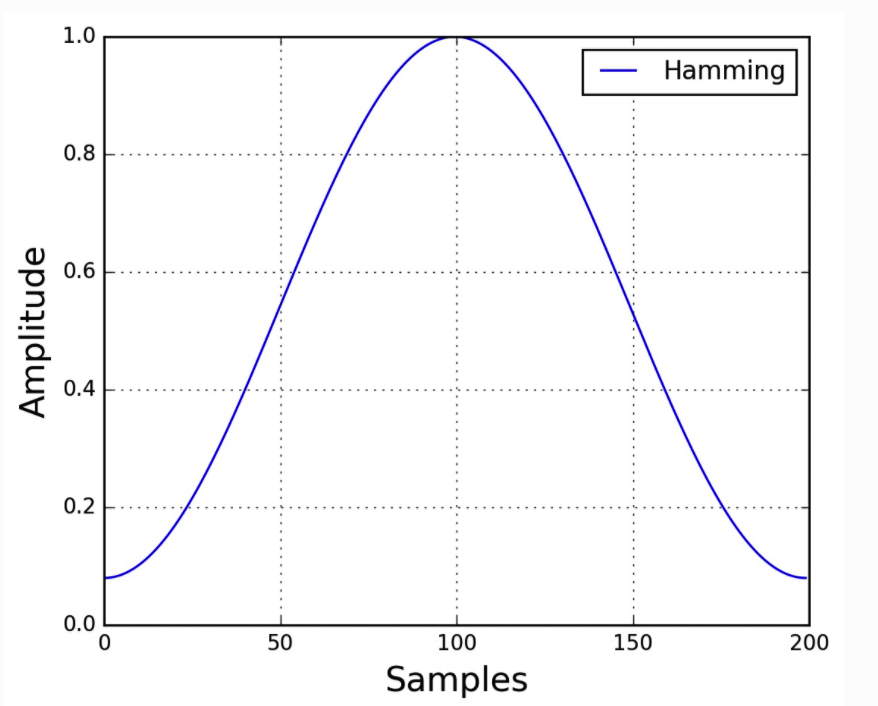
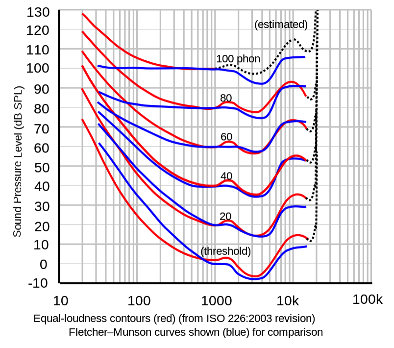
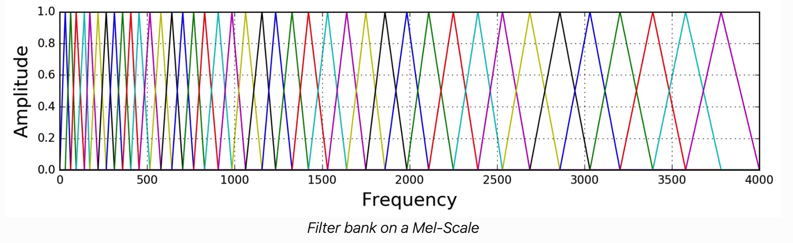

# [目录](../README.md)

# 语音特征

语音识别常用的特征包括FBank, MFCC, Pitch等, 常见的变换包括Delta变换和CMVN变换.

## FBank和MFCC

FBank和MFCC特征有很多相似之处, MFCC在FBank的基础上做了进一步处理.
FBank特征提取的更多是音频信号的本质, 而MFCC则受限于一些机器学习算法,
在语音识别中广泛使用.

Fbank特征的提取流程为:
1. 预加重.
2. 分帧.
3. 加窗.
4. 傅里叶变换.
5. 梅尔滤波.

### 预加重(Pre-Emphasis)

录制的语音信号通常会有频谱倾斜的现象, 即高频部分的幅度会比低频部分的小,
这通常与扬声器的频率响应有关.

预加重可以起到频谱平衡的作用, 增大高频的幅度. 预加重滤波器如下:

$$ y(t) = x(t) - \alpha x(n-1) $$

对应的传递函数为:

$$ H(z) = 1 - \alpha z^{-1} $$

对于语音识别来说, $ \alpha $通常取值0.97.

预加重可以起到频谱平衡的作用, 同时可以提升信噪比.
但是也会引入额外的边缘效应, 对于多通道而言, 可能由于边缘不一致导致串扰等问题.

### 分帧(Framing)

很多信号处理算法要求信号的平稳性, 而语音信号是非平稳的. 将信号分帧后,
可以近似认为一帧内的信号是平稳的. 为了避免信号突变, 分帧会存在一定重叠.

对于语音识别来说, 帧长和帧移的选取主要考虑音素的可区分性.
通常取帧长25ms, 帧移10ms, 即0 \~ 25ms为第一帧, 10 \~ 35ms为第二帧.

### 加窗(Window)

分帧后, 需要对每帧的信号进行加窗.

实际上, 分帧相当于加了矩形窗. 为了进行傅里叶变换, 需要经过周期延拓得到无限长信号,
完成傅里叶变换后通过低通滤波器获取指定频率区间的频谱图. 那么在对信号进行截断时,
频谱就发生了畸变. 原来集中在$ f0 $处的能量会分散到旁瓣, 也就是频谱泄漏.

因此需要好的窗函数, 来减少频谱泄漏. 例如常用的Hamming窗:

$$ w[n] = 0.54 - 0.46 cos \left( \frac {2 \pi n} {N - 1} \right),
\ 0 \leq n \leq N - 1 $$

### 傅里叶变换(Fourier Transform)

对每一帧进行短时傅里叶变换, 并对幅值求平方得到功率谱.

$$ P = \frac { \left| FFT(x_i) \right|^2} {N}  $$

### 梅尔滤波(Mel Filter Banks)

人耳的听觉在频域上是非线性的, 更容易区分低频的声音, 而对高频声音的区分度更低,
不同频率的声音听感也不一样. 参考如下的等响曲线.

梅尔刻度的目的就是模拟人耳听觉的非线性关系. 梅尔刻度$ m $和频率$ f $的关系如下:

$$ m = 2595 log_{10} \left( 1 + \frac {f} {700} \right) $$

$$ f = 700 \left( 10 ^ {m/2595} - 1 \right) $$

梅尔滤波器组如下, 每个滤波器在中心频率处幅值为1, 呈三角滤波的形式. 具体如下:

$$

H_m(k) = \left\{
\begin{aligned}
0 & \  & k < f(m - 1) \\
\frac {k - f(m - 1)} {f(m) - f(m - 1)} & \  & f(m - 1) \leq k < f(m) \\
1 & \  & k = f(m) \\
\frac {f(m + 1) - k} {f(m + 1) - f(m)} & \  & f(m) < k \leq f(m + 1) \\
0 & \  & k > f(m + 1) \\
\end{aligned}
\right.

$$

### FBank

将上述获取的功率谱通过梅尔滤波器组进行滤波, 就得到了FBank特征.

### MFCC

MFCC的流程通常为: FBank - 取log - DCT - 倒谱加权.

由于FBank特征系数之间是高度相关的, 采用DCT对FBank去相关化, 同时也可以实现压缩.

DCT拥有多种形式, 常用的DCT-II如下:

$$ X_k = \sum_{n=0}^{N-1} x_n cos
\left[ \frac \pi N {\left( n + \frac 1 2 \right)}  \right] $$

倒谱加权的作用主要是增加高频成分. 例如MFCC为$ N $阶, 加权系数为$ L $阶,
倒谱加权为:

$$ y_n = 1 + \frac L 2 sin \left( \frac {n \pi} L \right), 0 \leq n < N $$

## Pitch

Pitch特征提取就是计算声音基频F0的过程.

如果一个复杂信号和一个可变频率的正弦波在音调上听感一致,
那么正弦波的频率就是复杂信号的pitch.

Pitch特征的提取有多种方法, 例如:
1. Yin: Alain De Cheveign´e and Hideki Kawahara, “Yin, a fundamen- tal frequency estimator for speech and music,” The Journal of the Acoustical Society ofAmerica, vol. 111, pp. 1917, 2002.
2. Getf0: David Talkin, “A robust algorithm for pitch tracking (rapt),” Speech coding and synthesis, vol. 495, pp. 518, 1995.
3. SAcC: Daniel PWEllis and Byunk Suk Lee, “Noise robust pitch track- ing by subband autocorrelation classification,” in 13th Annual Conference of the International Speech Communication Asso- ciation, 2012.
4. Wu: M. Wu, D.L. Wang, and G.J. Brown, “A multipitch tracking algorithm for noisy speech,” IEEETransactions on Speech and Audio Processing, vol. 11, no. 3, pp. 229–241, 2003.
5. SWIPE: A. Camacho and J. G. Harris, “A sawtooth waveform inspired pitch estimator for speech and music,” Journal of the Acousti- cal Society ofAmerica, vol. 124, no. 3, pp. 1638–1652, 2008.
6. YAAPT: Kavita Kasi and Stephen A Zahorian, “Yet another algorithm for pitch tracking,” in Acoustics, Speech, and Signal Process- ing (ICASSP), 2002 IEEE International Conference on. IEEE, 2002, vol. 1, pp. I–361.

下面主要参考kaldi pitch: Ghahremani P, BabaAli B, Povey D, et al. A pitch extraction algorithm tuned for automatic speech recognition[C]//2014 IEEE international conference on acoustics, speech and signal processing (ICASSP). IEEE, 2014: 2494-2498.

kaldi pitch没有对每一帧是否为人声进行判断,
而是对每一帧都计算pitch, 使得pitch是一个连续的值, 更加符合语音识别任务.
主要提取流程如下:
1. 重采样.
2. 归一化.
3. NCCF(Normalized Cross Correlation Function)计算.
4. NCCF上采样.

### 重采样

假设采样后信号$ s(t) $, 第$ n $个采样点$ x_n $可以看作$ n / S $时刻的 $ \delta $函数,
$ S $为采样频率.

定义滤波函数$ f_{C,w}(t) $, 参数$ C \leq S/2 $表示截止频率, 窗宽$ w \geq 1$.

选取Hanning窗函数$ w(t) $, 定义滤波函数为:

$$ f_{C,w}(t) = 2C sinc(2Ct) w(t),
\ t \in \left[ \frac {-w} {2C}, \frac {w} {2C} \right] $$

其中, $ sinc $为归一化的sinc函数.

对于任意时刻$ t $, 计算窗内所有输入信号加窗后的数值之和, 得到重采样后的信号:

$$ s'(t) = \sum_n x_n \frac {f_{C,w}(t - n / S)} {S} $$

### 归一化.

将重采样后的信号除以均方值进行归一化.

### NCCF计算.

互相关(Cross Correlation Function, CCF)一般用来度量两个量之间的相似度,
它是一个向量相对于另一个向量的偏移的函数, 也叫滑动内积.
而自相关(Auto Correlation Function, ACF)就是信号自身与自身的互相关.

自相关函数在波形重合处会出现峰值, 因此可以用来计算序列中的重复模式, 即基频.
通过计算不同偏移处的自相关, 找到峰值处的偏移值.

对于ACF和CCF, 偏移越大, 计算的序列就越短, 那么不同偏移处的数值是无法比较的.
而NCCF通过归一化使得不同偏移处的数值可以比较.

为了寻找能够最大化NCCF的偏移, 先定义计算偏移的区间.

定义$ lag_{min} = 1/f_{0,max}, \ lag_{max} = 1/f_{0,min} $为计算NCCF的lag区间,
采用非线性的方式获取偏移值:

$$ L_i = lag_{min} {\left( 1 + \delta_{pitch} \right)}^i,
\ i \geq 0, L_i \leq lag_{max} $$

定义滤波宽度$ w $, 那么输出的lag区间为:
$$ lag_{min,outer} = lag_{min} - w/2,
\ lag_{max,outer} = lag_{max} + w/2 $$

这样可以在更大的偏移区间内计算NCCF.

对于帧索引$ t $, 需要处理的信号从$ t \cdot window_{shift} $开始,
长度为$ window_{width} + lag_{max,outer} $.
定义$ t $帧的信号为$ \bold{w}_t = \left( w_{t,0}, w_{t,1}, \cdots \right) $,
$ \bold{v}_{t,i} $为$ \bold{w}_t $内从$ i $开始, 长度为$ window_{width} $
的子序列.

那么可以得到第$ t $帧, 第$ l $个偏移处的NCCF为:

$$ nccf_{t,l} = \frac {\bold{v}_{t,0}^T \bold{v}_{t,l}}
{\sqrt{|| \bold{v}_{t,0} ||_2^2 || \bold{v}_{t,l} ||_2^2 +
 n^4 ballast}} $$

其中, 参数ballest的意义是, 降低ballest有利于非人声区域pitch计算的连续性.

### NCCF上采样
