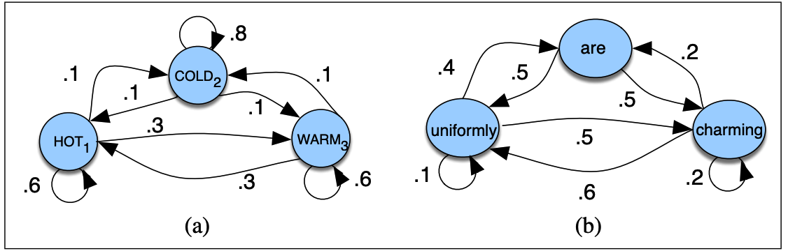
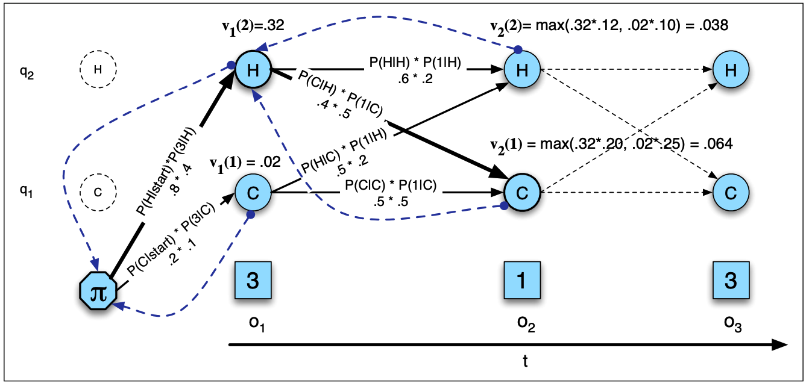
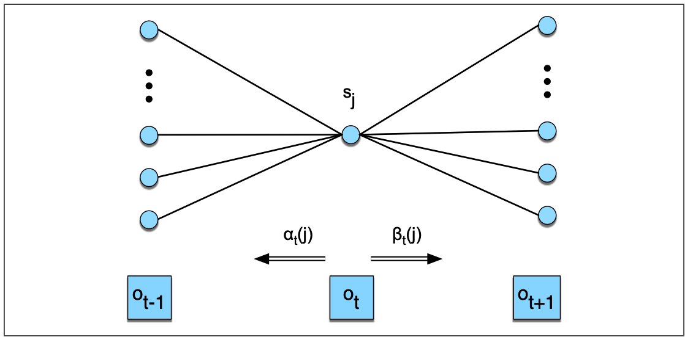

# [目录](../README.md)

# Hidden Markov Models

## Markov Chains

马尔科夫链, 是状态空间中从一个状态到另一个状态转换的随机过程.
对于马尔科夫链, 如果要从一个序列进行预测, 当前状态起到决定的作用,
历史状态对于预测没有影响.

假设一个序列内的状态变量为$ q_1, q_2, \cdots, q_i $. 可以将马尔可夫假设表示为:

$$ P(q_i = a|q_1 \cdots q_{i-1}) = P(q_i = a|q_{i-1}) $$

下图a给出了天气变化的马尔科夫链, 可能的天气为HOT, COLD和WARM.
图中, 状态以节点表示, 每条边上标明转移概率, 每个节点所有边的转移概率之和为1.
图b给出了一个二元语言模型的马尔科夫链.

综上, 马尔科夫链主要由三个部分组成:

$$
\begin{aligned}
& Q = q_1 q_2 \cdots q_N \\
& A = a_{11} a_{12} \cdots a_{1N} \cdots a_{NN} \\
& \pi = \pi_1, \pi_2 \cdots, \pi_N
\end{aligned}
$$

* $ Q $为$ N $个节点的集合.
* $ A $为转移概率矩阵, $ a_{ij} $表示节点$ i $到节点$ j $的转移概率,
且满足$ \sum_{j=1}^N a_{ij} = 1, \forall i $.
* $ \pi_i $为节点$ i $的初始概率分布, 满足$ \sum_{i=1}^N \pi_i = 1 $,
$ \pi_i = 0 $表示不可能为初始状态节点.

例如上图a中, 假设初始概率分布为$ \pi(hot, cold, warm) = [0.1, 0.7, 0.2] $,
那么:

$$ P(cold, hot, cold, hot) = 0.7 * 0.1 * 0.1 * 0.1 = 0.0007 $$

## Hidden Markov Models

很多情况下, 我们关心的状态是隐藏起来的.
例如, 我们通过文本无法直接观测到词性标注(POS), 我们只可以观测到词.
POS只能通过词序列来推测, 因此是被隐藏起来的.

HMM是一个同时包含了观测状态和隐藏状态的概率模型, 由五个部分组成:

$$
\begin{aligned}
& Q = q_1 q_2 \cdots q_N \\
& A = a_{11} \cdots a_{ij} \cdots a_{NN} \\
& O = o_1 o_2 \cdots o_T \\
& B = b_i(o_t) \\
& \pi = \pi_1, \pi_2 \cdots, \pi_N
\end{aligned}
$$

* $ Q $为$ N $个节点的集合.
* $ A $为转移概率矩阵, $ a_{ij} $表示节点$ i $到节点$ j $的转移概率,
且满足$ \sum_{j=1}^N a_{ij} = 1, \forall i $.
* $ O $为观测序列, 每个观测值来源于词典$ V = v_1, v_2, \cdots, v_V $.
* $ B $为发射概率, 表示节点$ i $产生观测$ o_t $的概率.
* $ \pi_i $为节点$ i $的初始概率分布, 满足$ \sum_{i=1}^N \pi_i = 1 $,
$ \pi_i = 0 $表示不可能为初始状态节点.

一阶马尔可夫模型遵循两个假设:

1. 某个状态节点的概率仅与前一个状态节点有关:

$$ P(q_i = a|q_1 \cdots q_{i-1}) = P(q_i = a|q_{i-1}) $$

2. 观测值$ o_i $仅与产生该观测值的节点$ q_i $有关, 与其他状态节点或者观测值无关,
即输出独立性:

$$ P(o_i|q_1 \cdots q_i \cdots q_t, o_1 \cdots o_i \cdots o_t) =
 P(o_i|q_i}) $$

下面用一个例子简述HMM模型. 假设有两种天气COLD(C)和HOT(H), 但是没有天气的信息,
只有每天吃掉的冰淇淋数量. 那么问题变成: 已知观测序列$ O $(每天吃掉的冰淇淋数量),
寻找天气(C或者H)对应的隐序列$ Q $, 如下图.
观测序列$ O = \{1, 2, 3\} $对应每天吃掉的冰淇淋数量.

HMM的三个问题:

1. Likelihood: 已知HMM模型 $ \lambda = (A, B) $, 给定观测序列$ O $,
计算似然$ P(O|\lambda) $.
2. Decoding: 已知HMM模型 $ \lambda = (A, B) $, 给定观测序列$ O $,
获取最可能的隐状态序列$ Q $.
3. Learning: 给定观测序列$ O $和一系列状态, 学习HMM的参数$ A $和$ B $.

下面以冰淇淋-天气案例, 分别对这三个问题进行分析和求解, 代码见[hmm.py](hmm.py).

## Likelihood - The Forward Algorithm

假设HMM已知, 计算观测序列(冰淇淋数量)为3 1 3的概率.

由于每个隐状态仅仅产生一个观测值, 隐状态序列长度与观测值序列长度相等.
那么, 给定隐状态序列$ Q = q_0, q_1, \cdots, q_T $和观测序列
$ Q = o_0, o_1, \cdots, o_T $, 观测序列的似然可以表示为:

$$ P(O|Q) = \prod_{i=1}^{T} P(o_i|q_i) $$

那么一条可能的隐状态hot hot cold对应的似然为:

$$ P(3\ 1\ 3|hot\ hot\ cold) = P(3|hot) \times P(1|hot) \times P(3|cold) $$

每一条隐状态序列的产生都拥有一定的概率, 容易求出其概率, 得到加权后观测序列的似然为:

$$ P(O|Q) = P(O|Q) \times P(Q) = \prod_{i=1}^{T} P(o_i|q_i)
\times \prod_{i=1}^{T} P(q_i|q_{i-1}) $$

即:

$$ P(3\ 1\ 3|hot\ hot\ cold) = P(3|hot) \times P(1|hot) \times P(3|cold)
\times P(hot|start) \times P(hot|hot) \times P(cold|hot) $$

最后, 将所有可能的隐状态序列对应的似然进行加权求和:

$$ P(O) = \sum_Q P(O|Q) = \sum_Q \left[ \prod_{i=1}^{T} P(o_i|q_i)
\times \prod_{i=1}^{T} P(q_i|q_{i-1}) \right] $$

即:

$$ P(3\ 1\ 3) = P(3\ 1\ 3|hot\ hot\ cold) + P(3\ 1\ 3|cold\ cold\ cold)
+ \cdots $$

### The Forward Algorithm

对于拥有$ N $个隐状态的HMM, 如果观测序列长度为$ T $, 那么总共可能有
$ N^T $个隐序列. 对于一般的任务, $ N $和$ T $可能很大, 导致计算代价太大.

因此采用动态规划的前向算法, 对每一条可能的路径进行概率求和, 复杂度为$ O(N^2 T) $.

如上图, 网格的节点$ \alpha_t(j) $表示经历过前$ t $个观测后状态$ j $的总概率:

$$ \alpha_t(j) = P(o_1, o_2, \cdots, o_t, q_t = j|\lambda) $$

可以得到$ \alpha_t(j) $的递归表达:

$$ \alpha_t(j) = \sum_i^N \alpha_{t - 1}(i) a_{ij} b_j(o_t) $$

这样可以将前向算法写作:

1. 初始化:

$$ \alpha_1(j) = \pi_j b_j(o_1), 1 \leq j \leq N $$

2. 递归:

$$ \alpha_t(j) = \sum_i^N \alpha_{t - 1}(i) a_{ij} b_j(o_t),
1 \leq j \leq N, 1 < t \leq T $$

3. 终止:

$$ P(O|\lambda) = \sum_i^N \alpha_T(i) $$

## Decoding - The Viterbi Algorithm

解码, 就是给定观测序列, 获取概率最大的隐序列.

例如, 对于例子中的HMM, 给定观测序列(冰淇淋数量){3, 1, 3},
解码的目标是获取最可能的天气序列.

对于每一条隐序列, 我们可以通过前向算法计算其似然, 然后找到似然最大的隐序列,
但是这种算法复杂度太高. 因此采用动态规划的Viterbi算法来计算, 如下图.

Viterbi算法的思想是, 针对观测序列从左到右计算网格值$ v_t(j) $,
代表了状态$ j $对于前$ t $个观测值最可能的隐状态序列
$ q_1, \cdots, q_{t-1} $的概率:

$$ v_t(j) = \mathop{max}\limits_{q_1, \cdots, q_{t-1}}
P(q_1 \cdots q_{t-1}, o_1, \cdots, o_t, q_t = j| \lambda) $$

容易得到$ v_t(j) $的递归表达:

$$ v_t(j) = \mathop{max}\limits_{i=1}^N v_{t-1}(i) a_{ij} b_j(o_t) $$

为了获取最大似然的隐状态序列, 在动态计算概率的过程中,
还需要一个状态量来保存每次取max的路径.

这样可以将Viterbi算法写作:

1. 初始化:

$$
\begin{aligned}
v_1(j) & = \pi_j b_j(o_1), \ & 1 \leq j \leq N  \\
bt_1(j) & = 0, \ & 1 \leq j \leq N
\end{aligned}
$$

2. 递归:

$$
\begin{aligned}
v_t(j) & = \mathop{max}\limits_{i=1}^N v_{t-1}(j) a_{ij} b_j(o_t),
\ & 1 \leq j \leq N, 1 \leq j \leq T \\
bt_t(j) & = \mathop{argmax}\limits_{i=1}^N v_{t-1}(j) a_{ij} b_j(o_t),
\ & 1 \leq j \leq N, 1 \leq j \leq T
\end{aligned}
$$

3. 终止:

$$
\begin{aligned}
The \ best \ score: \ P* & = \mathop{max}\limits_{i=1}^N v_T(i) \\
The \ start \ of \ backtrace: \ q_T* & = \mathop{argmax}\limits_{i=1}^N
v_T(i)
\end{aligned}
$$

## HMM Training - The Forward-Backward Algorithm

HMM训练采用前向-后向算法, 或者Baum-Wehch算法, 一种EM算法来训练.
给定观测序列和可能的隐状态集合, 通过训练来学习HMM的转移概率和发射概率.
对于每一次迭代, 通过一个状态量来评估模型的优劣, 并不断朝着优化状态量的方向更新.

对于一个简单的例子, 假设存在三组观测序列和隐序列的对应关系:
hot hot cold -> 3 3 2; cold cold cold -> 1 1 2; cold hot hot -> 1 2 3.

那么很容易通过最大似然估计得到HMM的参数:
$$
\begin{aligned}
\pi_h = 1/3 \ \ & \ \pi_c = 2/3 \\
p(hot|hot) = 2/3 \ \ & \ p(cold|hot) = 1/3 \\
p(cold|cold) = 2/3 \ \ & \ p(hot|cold) = 1/3 \\
P(1|hot) = 0 \ \ & \ p(1|cold) = 0.6 \\
p(2|hot) = 0.25 \ \ & \ p(2|cold) = 0.4 \\
p(3|hot) = 0.75 \ \ & \ p(3|cold) = 0
\end{aligned}
$$

然而, 实际情况下, 我们无法知道一个观测序列对应的隐状态序列, 我们仅仅能获取其概率.

在前向算法中定义了前向概率, 还需要定义后向概率$ \beta $, 表示从$ t + 1 $
个观测值到最后的概率:

$$ \beta_t(i) = P(o_{t+1} o_{t+2} \cdots o_T, q_t = i|\lambda) $$

后向概率的计算与前向概率相似:

1. 初始化:

$$ \beta_T(i) = 1, 1 \leq i \leq N $$

2. 递归:

$$ \beta_t(i) = \sum_j^N \beta_{t + 1}(j) a_{ij} b_j(o_{t+1}),
1 \leq i \leq N, 1 < t \leq T $$

3. 终止:

$$ P(O|\lambda) = \sum_j^N \pi_j b_j(o_1) \beta_1(j) $$

通过前向概率和后向概率就可以估计转移概率和发射概率. 转移概率的最大似然估计为:

$$ \tilde{a}_{ij} = \frac {number\ of\ transitions\ from\ state\ i\ to
\ state\ j} {number\ of\ transitions\ of\ state\ i} $$

对于上式的分母, 如果对于观测序列上$ t $时刻的某个观测值,
能够估计出$ i \rightarrow j $的转移概率,
那么可以通过对所有时刻的求和得到$ i \rightarrow j $的转移概率.

定义$ t $时刻状态为$ i $, $ t + 1 $时刻状态为$ j $的概率为$ \xi_t $:

$$ \xi_t(i, j) = P(q_t = i, q_{t+1} = j|O, \lambda) $$

为了计算上式, 先计算包含观测序列概率的$ \xi_t $:

$$ not-quite-\xi_t(i, j) = P(q_t = i, q_{t+1} = j, O| \lambda) $$

从上图可以看出$ not-quite-\xi_t $的计算为:

$$ not-quite-\xi_t(i, j) = \alpha_t(i) a_{ij} b_j(o_{t+1})
\beta_{t+1}(j) $$

根据贝叶斯定理:

$$ P(X|Y, Z) = \frac {P(X, Y|Z)} {P(Y|Z)} $$

可得:

$$
\begin{aligned}
\xi_t(i, j) & = P(q_t = i, q_{t+1} = j|O, \lambda) \\
& = \frac {P(q_t = i, q_{t+1} = j, O|\lambda)} {P(O|\lambda)} \\
& = \frac {\alpha_t(i) a_{ij} b_j(o_{t+1}) \beta_{t+1}(j)}
{\sum_{j=1}^N \alpha_t(j) \beta_t(j)}
\end{aligned}
$$

那么将上式对所有$ t $求和就可以得到从状态$ i $到状态$ j $的所有转移数量.
还需要计算状态$ i $的所有转移数量, 可以对所有以状态$ i $为起始的转移进行求和得到.
这样, 就得到了转移概率的计算公式:

$$ \tilde{a}_{ij} = \frac {\sum_{t=1}^{T-1} \xi_t(i,j)}
{\sum_{t=1}^{T-1} \sum_{k=1}^N \xi_t(i,k)} $$

同样, 还需要计算发射概率:

$$ b_j(v_k) = \frac {number\ of\ times\ in\ state\ j\ and\ observing
\ symbol\ v_k} {number\ of\ times\ in\ state\ j} $$

为了计算上式, 需要知道时刻$ t $在状态$ j $的概率:

$$ \gamma_t(j) = P(q_t = j|O, \lambda) $$

根据贝叶斯定理, 可以将上式写作:

$$ \gamma_t(j) = \frac {P(q_t = j, O| \lambda)} {P(O|\lambda)} $$

通过上图可以看出, 分子项就是前向概率和后向概率的乘积, 那么可得:

$$ \gamma_t(j) = \frac {\alpha_t(j) \beta_t(j)} {P(O|\lambda)} $$

那么就得到了发射概率的计算如下:

$$ b_j(v_k) = \frac {\sum_{t=1\ s.t.\ o_t=v_k}^T \gamma_t(j)}
{\sum_{t=1}^T \gamma_t(j)} $$

这样, 就可以通过E-M算法不断迭代估计HMM的参数, 直到收敛. 前向后向算法如下:

1. 初始化转移概率矩阵$ A $和发射概率矩阵$ B $.

2. E-step:

$$
\begin{aligned}
\gamma_t(j) & = \frac {\alpha_t(j) \beta_t(j)} {\alpha_T(q_F)}
\ \forall t\ and\ j \\
\xi_t(i, j) & = \frac {\alpha_t(i) a_{ij} b_j(o_{t+1}) \beta_{t + 1}(j)}
{\alpha_T(q_F)}\ \forall t,\ i\ and\ j
\end{aligned}
$$

3. M-step

$$
\begin{aligned}
\tilde{a}_{ij} &= \frac {\sum_{t=1}^{T-1} \xi_t(i, j)}
{\sum_{t=1}^{T-1} \sum_{k=1}^N \xi_t(i, k)} \\
\tilde{b}_{j}(v_k) &= \frac {\sum_{t=1\ s.t.\ o_t=v_k}^T \gamma_t(j)}
{\sum_{t=1}^T \gamma_t(j)}
\end{aligned}
$$

4. 重复2和3直到收敛, 返回$ A $和$ B $.
