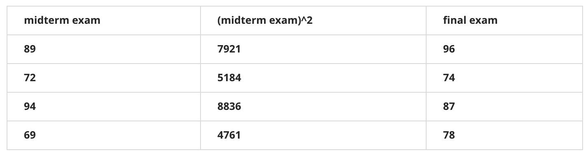

# [目录](../README.md)

# Linear Regression

## Definition
对于回归问题, 假设有一堆训练集, 记:
*  - 训练集的样本数量.
*  - 输入变量/特征.
*  - 输出变量/目标变量.
*  - 一个样本对.
*  - 第个样本对.

## Model Representation
学习算法通过对训练数据的学习来获取模型, 也称作hypothesis.
在预测阶段, 将输入模型得到预测的.

## Cost Function
我们可以采用代价函数来评估模型的准确性.

假设模型为:

其中, 和是待定参数, 不同的参数得到的模型也不同.

目标是选取最好的和, 使得模型对训练集的拟合程度较好,
即尽可能与接近, 那么可以将代价函数写成:

因此, 目标就转化为最小化代价函数:

可以将代价函数对和求偏导并等于0, 从而得到最优的参数.

## Gradient Descent
给定不同的参数和, 得到的代价函数值也不一样,
可以将代价函数随着参数变化的曲面绘制出来. 代价函数最小的点, 也就是曲线上最低的点,
此时的参数就是最优模型. 给定初始的参数和,
采用梯度下降算法对参数不断更新, 在曲面上不断"下山", 直到最低点得到最优的参数.

梯度下降算法:

上式中, 称作学习率. 如果学习率较大, 梯度下降就会采用较大的步长下降;
如果学习率较小, 梯度下降就会采用较小的步长下降.

梯度下降算法根据每次更新使用的数据量, 分为:
* Batch Gradient Descent: 每次使用所有训练数据.
* Mini-Batch Gradient Descent: 每次使用训练数据的一个子集.

## Learning Rate
学习率太小, 梯度下降速度可能会很慢.

学习率太大, 梯度下降可能错过局部最优点, 可能不会收敛, 甚至发散.

如果达到最优点, 此时梯度下降算法再更新, 参数就不会再发生变化.

由于梯度下降过程中, 梯度项会不断减小, 因此, 即时学习率固定, 也可以收敛到局部最优.

如果代价函数降低较慢, 或者梯度下降不工作, 使用更小的学习率.

## Gradient Descent For Linear Regression
将线性回归的模型代入梯度下降的公式, 偏导项变为:

可以求出和时的偏导项为:

那么梯度下降算法变为:

注意: 线性回归的搜索空间为凸函数, 因此仅存在全局最优解.

## Multivariate Linear Regression
拓展到更一般的形式, 记:
*  - 特征的维度.
*  - 第个样本.
*  - 第个样本的第个特征.

将模型写成:

将上式向量化, 记:

, 

这样就可以将模型写成:

代价函数为:

梯度下降为:

将线性回归模型代入代价函数可以推导出梯度下降为:

## Speech Up Gradient Descent
Feature scaling: 将特征除以特征值的范围(最大值 - 最小值),
保证所有特征在近似的尺度.

Mean normalization: 将特征减去特征的平均值, 使得特征近似0均值.

结合feature scaling和mean normalization, 将特征写成:

其中, 为所有特征的平均值, 为特征的最大值 - 最小值,
或者是特征的标准差.

## Normal Equation
线性回归也可以采用下式来直接计算(代价函数求导为0直接推导):

如果特征数比较大, 采用上式会导致计算速度太慢.

## Quiz
1. Consider the problem of predicting how well a student does in her
second year of college/university, given how well she did in her first
year.  
Specifically, let  be equal to the number of "A" grades (including
A-. A and A+ grades) that a student receives in their first year of
college (freshmen year). We would like to predict the value of ,
which we define as the number of "A" grades they get in their second
year (sophomore year).  
Refer to the following training set of a small sample of different
students' performances (note that this training set may also be
referenced in other questions in this quiz). Here each row is one
training example. Recall that in linear regression, our hypothesis is
, and we use  to denote the
number of training examples.  
For the training set given above, what is the value of ?  
(4)

2. Many substances that can burn (such as gasoline and alcohol) have a
chemical structure based on carbon atoms; for this reason they are
called hydrocarbons. A chemist wants to understand how the number of
carbon atoms in a molecule affects how much energy is released when that
molecule combusts (meaning that it is burned). The chemist obtains the
dataset below. In the column on the right, "kJ/mol" is the unit
measuring the amount of energy released.  
You would like to use linear regression () to estimate the amount of energy released () as a
function of the number of carbon atoms (). Which of the following
do you think will be the values you obtain for  and
?  
You should be able to select the right answer without actually
implementing linear regression.  
(D)  
A.   
B.   
C.   
D. 

3. Suppose we set  in the linear
regression hypothesis from Q1. What is ?  
(11)

4. Let  be some function so that  outputs
a number. For this problem,  is some arbitrary/unknown smooth
function (not necessarily the cost function of linear regression, so
 may have local optima).  
Suppose we use gradient descent to try to minimize
 as a function of  and .
Which of the following statements are true? (Check all that apply.)  
(AD)  
A. If the learning rate is too small, then gradient descent may take a
very long time to converge.  
B. If  and  are initialized so that
, then by symmetry (because we do simultaneous
updates to the two parameters), after one iteration of gradient descent,
we will still have .  
C. Even if the learning rate  is very large, every iteration of
gradient descent will decrease the value of .  
D. If  and  are initialized at a local minimum,
then one iteration will not change their values.

5. Suppose that for some linear regression problem (say, predicting
housing prices as in the lecture), we have some training set, and for
our training set we managed to find some ,  such
that .  
Which of the statements below must then be true? (Check all that apply.)  
(D)  
A. For this to be true, we must have  and
, so that .  
B. Gradient descent is likely to get stuck at a local minimum and fail
to find the global minimum.  
C. For this to be true, we must have  for every value of
.  
D. Our training set can be fit perfectly by a straight line, i.e., all
of our training examples lie perfectly on some straight line.

6. Suppose  students have taken some class, and the class had a
midterm exam and a final exam. You have collected a dataset of their
scores on the two exams, which is as follows.  
You'd like to use polynomial regression to predict a student's final
exam score from their midterm exam score. Concretely, suppose you want
to fit a model of the form
,
where  is the midterm score and  is (midterm score)^2.
Further, you plan to use both feature scaling (dividing by the
"max-min", or range, of a feature) and mean normalization.  
What is the normalized feature x_1^{(1)}? (Please round off your answer
to two decimal places).  
(-0.32)

7. You run gradient descent for 15 iterations with  and
compute  after each iteration. You find that the value of
 decreases quickly then levels off. Based on this, which of
the following conclusions seems most plausible?  
(B)  
A. Rather than use the current value of , it'd be more
promising to try a smaller value of  (say ).  
B.  is an effective choice of learning rate.  
C. Rather than use the current value of , it'd be more
promising to try a larger value of  (say ).

8. Suppose you have  training examples with  features
(excluding the additional all-ones feature for the intercept term, which
you should add). The normal equation is
.
For the given values of  and , what are the dimensions of
, , and  in this equation?  
(D)  
A.  is ,  is ,
 is .  
B.  is ,  is ,
 is .  
C.  is ,  is ,
 is .  
D.  is ,  is ,
 is .

9. Suppose you have a dataset with  examples and
 features for each example. You want to use multivariate
linear regression to fit the parameters  to our data. Should
you prefer gradient descent or the normal equation?  
(D)  
A. The normal equation, since it provides an efficient way to directly
find the solution.  
B. The normal equation, since gradient descent might be unable to find
the optimal .  
C. Gradient descent, since it will always converge to the optimal
.  
D. Gradient descent, since  will be very
slow to compute in the normal equation.

10. Which of the following are reasons for using feature scaling?  
(B)  
A. It speeds up gradient descent by making each iteration of gradient
descent less expensive to compute.  
B. It speeds up gradient descent by making it require fewer iterations
to get to a good solution.  
C. It is necessary to prevent the normal equation from getting stuck
in local optima.  
D. It prevents the matrix  (used in the
normal equation) from being non-invertable (singular/degenerate).

## Exercise1
根据城市的人口来预测利润, 代码见[exercise1.py](exercise1.py).

[data1.txt](data1.txt)包含不同城市的数据, 第一列为城市的人口, 第二列为利润.
如下图.

采用梯度下降得到最优参数为: .
利用该参数可以预测得到人口为35000时, 利润为40819.05.

将最优参数代入训练集进行拟合, 得到下图:

绘制代价函数随着参数和变化的surface图和contour图如下.

## Exercise2
预测房屋售价, 代码见[exercise2.py](exercise2.py).

[data2.txt](data2.txt)包含不同房屋的售价, 第一列为房子的大小(平方米),
第二列为卧室的数量, 第三列为房屋的售价.

由于存在多个特征, 需要先对特征进行归一化. 注意需要保存归一化的均值和标准差参数,
在预测时也要使用相同的参数对特征进行归一化.

不同学习率代价函数曲线如下. 可以看出, 学习率较小时, 收敛速度较慢.

梯度下降得到的最优参数为: [340410.91897 109162.68848 -6293.24735].
房屋尺寸为1650, 卧室数量为3时, 梯度下降预测得到的房价: 293142.43.

采用Normal Equation得到的最优参数为: [89597.90954 139.21067 -8738.01911].
房屋尺寸为1650, 卧室数量为3时, 梯度下降预测得到的房价: 293081.46.

可以看出, 虽然梯度下降得到的参数与Normal Equation相差较大, 但是预测值非常接近.
