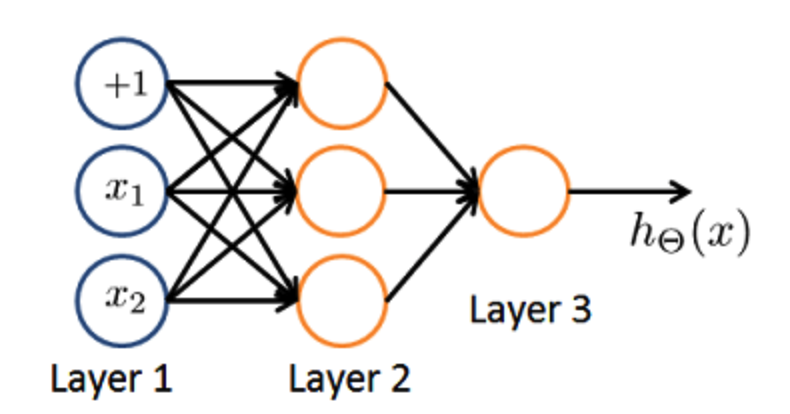
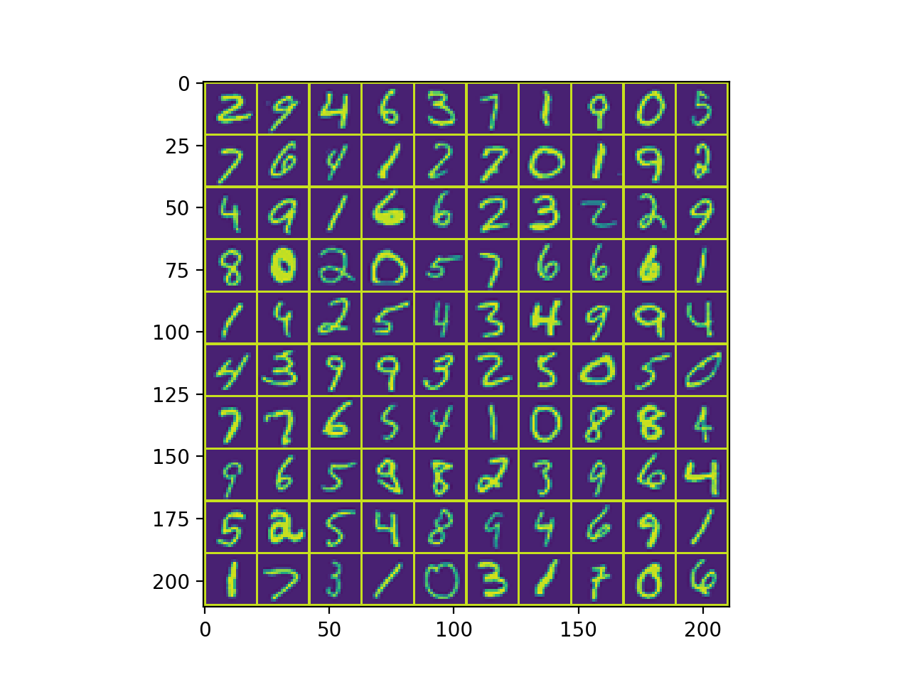

# [目录](../README.md)

# Neural Networks

## Model Representation

神经网络可以表示如下:

假设有个训练样本: , 定义为网络的层数,
为第层的单元数(不包含偏置单元数).

对于二分类问题,  或者 .

对于多分类问题, 输出为one-hot向量,
例如.

## Cost Function

神经网络的代价函数是逻辑回归更加一般化的表达:

其中, 为分类数, 为第类输出.

## Vectorized

记:

那么可以将前向计算向量化为:

## Quiz
1. Which of the following statements are true? Check all that apply.  
(AC)  
A. Any logical function over binary-valued (0 or 1) inputs  and
 can be (approximately) represented using some neural network.  
B. Suppose you have a multi-class classification problem with three
classes, trained with a 3 layer network.
Let  be the activation of the first
output unit, and similarly  and
 . Then for any input , it must be
the case that .  
C. The activation values of the hidden units in a neural network, with
the sigmoid activation function applied at every layer, are always in
the range (0, 1).  
D. A two layer (one input layer, one output layer; no hidden layer)
neural network can represent the XOR function.  

2. Consider the following neural network which takes two binary-valued
inputs  and outputs . Which of
the following logical functions does it (approximately) compute?  
(A)  
A. OR  
B. AND  
C. NOT AND  
D. XOR  

3. Consider the neural network given below. Which of the following
equations correctly computes the activation ?
Note: is the sigmoid activation function.  
(A)  
A.   
B.   
C.   
D.   

4. You have the following neural network. You'd like to compute the
activations of the hidden layer . You want to have a
vectorized implementation. Which of the following implementations
correctly compute? Check all that apply.  
(A)  
A.   
B.   
C.   
D.   

5. You are using the neural network pictured below and have learned the
parameters 
(used to compute ) and 
(used to compute  as a function of ).
Suppose you swap the parameters for the first hidden layer between its
two units so  and also swap the output layer so
. How will this change the value of the output
?  
(A)  
A. It will stay the same.  
B. It will increase.  
C. It will decrease.  
D. Insufficient information to tell: it may increase or decrease.  

## Exercise

手写数字识别, 通过神经网络识别数字0 ~ 9, 代码见[exercise.py](exercise.py).

输入样本数量为5000, 每张数字图像的像素点数为400, 即20 × 20.

随机抽取100张绘图如下:

